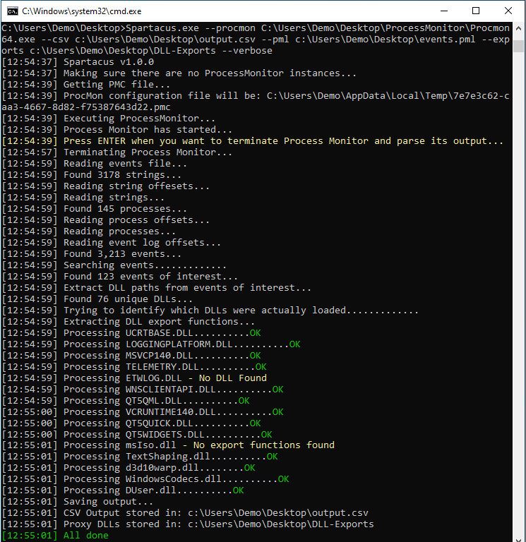
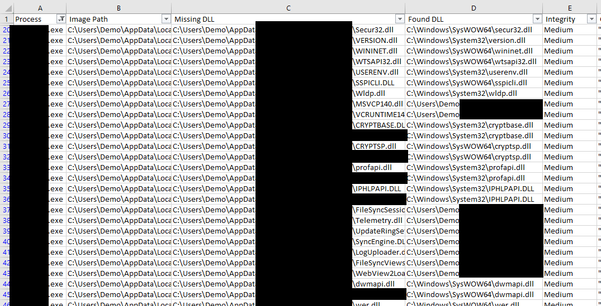
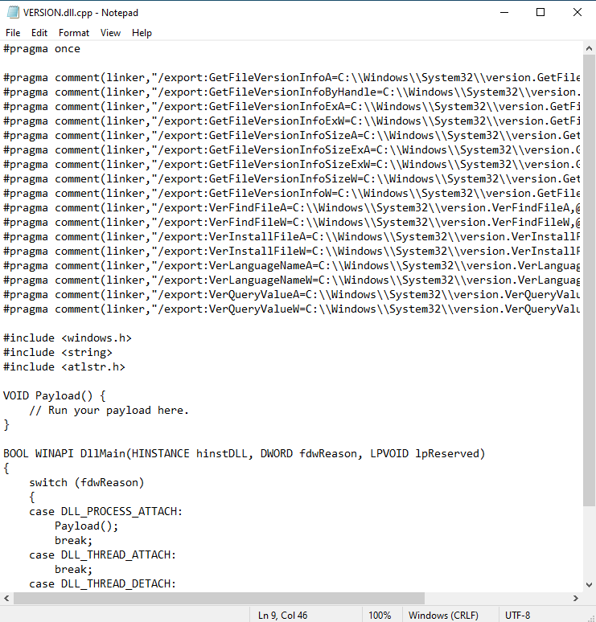

# Spartacus DLL Hijacking 

## Why "Spartacus"?

If you have seen the film Spartacus from 1960, you will remember the scene where the Romans are asking for Spartacus to give himself up. The moment the real Spartacus stood up, a lot of others stood up as well and claimed to be him using the "I AM SPARTACUS" phrase.

When a process that is vulnerable to DLL Hijacking is asking for a DLL to be loaded, it's kind of asking "WHO IS VERSION.DLL?" and random directories start claiming "I AM VERSION.DLL" and "NO, I AM VERSION.DLL". And thus, Spartacus.

## Did you really make yet another DLL Hijacking discovery tool?

...but with a twist as Spartacus is utilising the [SysInternals Process Monitor](https://learn.microsoft.com/en-us/sysinternals/downloads/procmon) and is parsing raw PML log files. You can leave ProcMon running for hours and discover 2nd and 3rd level (ie an app that loads another DLL that loads yet another DLL when you use a specific feature of the parent app) DLL Hijacking vulnerabilities. It will also automatically generate proxy DLLs with all relevant exports for vulnerable DLLs.

## Features

* Parsing ProcMon PML files natively. The config (PMC) and log (PML) parsers have been implemented by porting partial functionality to C# from https://github.com/eronnen/procmon-parser/. You can find the format specification [here](https://github.com/eronnen/procmon-parser/tree/master/docs).
* Spartacus will create proxy DLLs for all missing DLLs that were identified. For instance, if an application is vulnerable to DLL Hijacking via `version.dll`, Spartacus will create a `version.dll.cpp` file for you with all the exports included in it. Then you can insert your payload/execution technique and compile.
* Able to process large PML files and store all DLLs of interest in an output CSV file. Local benchmark processed a 3GB file with 8 million events in 45 seconds.
* `[Defence]` Monitoring mode trying to identify running applications proxying calls, as in "DLL Hijacking in progress". This is just to get any low hanging fruit and should not be relied upon.

# Table of Contents

* [Screenshots](#screenshots)
    * [Spartacus Execution](#spartacus-execution)
    * [CSV Output](#csv-output)
    * [Exports](#output-exports)
    * [Export DLL Functions](#export-dll-functions)
* [Usage](#usage)
    * [Execution Flow](#execution-flow)
    * [Command Line Arguments](#command-line-arguments)
    * [Examples](#examples)
    * [Proxy DLL Template](#proxy-dll-template)
* [Contributions](#contributions)
* [Credits](#credits)

# Screenshots

## Spartacus Execution



## CSV Output



## Output Exports


## Export DLL Functions



# Usage

## Execution Flow

1. Generate a ProcMon (PMC) config file on the fly, based on the arguments passed. The filters that will be set are:
    * Operation is `CreateFile`.
    * Path ends with `.dll`.
    * Process name is not `procmon.exe` or `procmon64.exe`.
    * Enable `Drop Filtered Events` to ensure minimum PML output size.
    * Disable `Auto Scroll`.
2. Execute Process Monitor.
3. Halt its execution until the user presses `ENTER`.
4. Terminates Process Monitor.
5. Parses the output Event Log (PML) file.
    1. Creates a CSV file with all the NAME_NOT_FOUND and PATH_NOT_FOUND DLLs.
    2. Compares the DLLs from above and tries to identify the DLLs that were actually loaded.
    3. For every "found" DLL it generates a proxy DLL with all its export functions.

## Command Line Arguments

| Argument                  | Description |
| ------------------------- | ----------- |
| `--pml`                   | Location (file) to store the ProcMon event log file. If the file exists, it will be overwritten. When used with `--existing-log` it will indicate the event log file to read from and will not be overwritten. |
| `--pmc`                   | Define a custom ProcMon (PMC) file to use. This file will not be modified and will be used as is. |
| `--csv`                   | Location (file) to store the CSV output of the execution. This file will include only the DLLs that were marked as NAME_NOT_FOUND, PATH_NOT_FOUND, and were in user-writable locations (it excludes anything in the `Windows` and `Program Files` directories) |
| `--exe`                   | Define process names (comma separated) that you want to track, helpful when you are interested only in a specific process. |
| `--exports`               | Location (folder) in which all the proxy DLL files will be saved. Proxy DLL files will only be generated if this argument is used. |
| `--procmon`               | Location (file) of the SysInternals Process Monitor `procmon.exe` or `procmon64.exe` |
| `--proxy-dll-template`    | Define a DLL template to use for generating the proxy DLL files. Only relevant when `--exports` is used. All `#pragma` exports are inserted by replacing the `%_PRAGMA_COMMENTS_%` string, so make sure your template includes that string in the relevant location. |
| `--existing-log`          | Switch to indicate that Spartacus should process an existing ProcMon event log file (PML). To indicate the event log file use `--pml`, useful when you have been running ProcMon for hours or used it in Boot Logging. |
| `--all`                   | By default any DLLs in the Windows or Program Files directories will be skipped. Use this to include those directories in the output. |
| `--detect`                | Try to identify DLLs that are proxying calls (like 'DLL Hijacking in progress'). This isn't a feature to be relied upon, it's there to get the low hanging fruit. |
| `--verbose`               | Enable verbose output. |
| `--debug`                 | Enable debug output. |

## Examples

Collect all events and save them into `C:\Data\logs.pml`. All vulnerable DLLs will be saved as `C:\Data\VulnerableDLLFiles.csv` and all proxy DLLs in `C:\Data\DLLExports`.

```
--procmon C:\SysInternals\Procmon.exe --pml C:\Data\logs.pml --csv C:\Data\VulnerableDLLFiles.csv --exports C:\Data\DLLExports --verbose
```

Collect events only for `Teams.exe` and `OneDrive.exe`.

```
--procmon C:\SysInternals\Procmon.exe --pml C:\Data\logs.pml --csv C:\Data\VulnerableDLLFiles.csv --exports C:\Data\DLLExports --verbose --exe "Teams.exe,OneDrive.exe"
```

Collect events only for `Teams.exe` and `OneDrive.exe`, and use a custom proxy DLL template at `C:\Data\myProxySkeleton.cpp`.

```
--procmon C:\SysInternals\Procmon.exe --pml C:\Data\logs.pml --csv C:\Data\VulnerableDLLFiles.csv --exports C:\Data\DLLExports --verbose --exe "Teams.exe,OneDrive.exe" --proxy-dll-template C:\Data\myProxySkeleton.cpp
```

Collect events only for `Teams.exe` and `OneDrive.exe`, but don't generate proxy DLLs.

```
--procmon C:\SysInternals\Procmon.exe --pml C:\Data\logs.pml --csv C:\Data\VulnerableDLLFiles.csv --verbose --exe "Teams.exe,OneDrive.exe"
```

Parse an existing PML event log output, save output to CSV, and generate proxy DLLs.

```
--existing-log --pml C:\MyData\SomeBackup.pml --csv C:\Data\VulnerableDLLFiles.csv --exports C:\Data\DLLExports
```

Run in monitoring mode and try to detect any applications that is proxying DLL calls.

```
--detect
```

## Proxy DLL Template

Below is the template that is used when generating proxy DLLs, the generated `#pragma` statements are inserted by replacing the `%_PRAGMA_COMMENTS_%` string.

The only thing to be aware of is that the `pragma` DLL will be using a hardcoded path of its location rather than trying to load it dynamically.

```cpp
#pragma once

%_PRAGMA_COMMENTS_%

#include <windows.h>
#include <string>
#include <atlstr.h>  

VOID Payload() {
    // Run your payload here.
}

BOOL WINAPI DllMain(HINSTANCE hinstDLL, DWORD fdwReason, LPVOID lpReserved)
{
    switch (fdwReason)
    {
    case DLL_PROCESS_ATTACH:
        Payload();
        break;
    case DLL_THREAD_ATTACH:
        break;
    case DLL_THREAD_DETACH:
        break;
    case DLL_PROCESS_DETACH:
        break;
    }
    return TRUE;
}
```

If you wish to use your own template, just make sure the `%_PRAGMA_COMMENTS_%` is in the right place.

# Contributions
Whether it's a typo, a bug, or a new feature, Spartacus is very open to contributions as long as we agree on the following:
* You are OK with the MIT license of this project.
* Before creating a pull request, create an issue so it could be discussed before doing any work as internal development is not tracked via the public GitHub repository. Otherwise you risk having a pull request rejected if for example we are already working on the same/similar feature, or for any other reason.

# Credits

* https://github.com/eronnen/procmon-parser/
