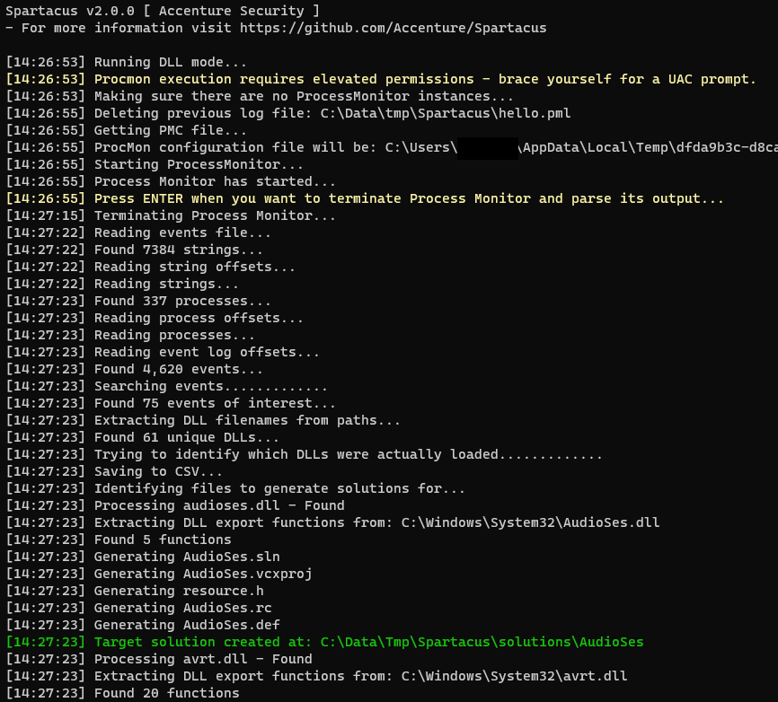
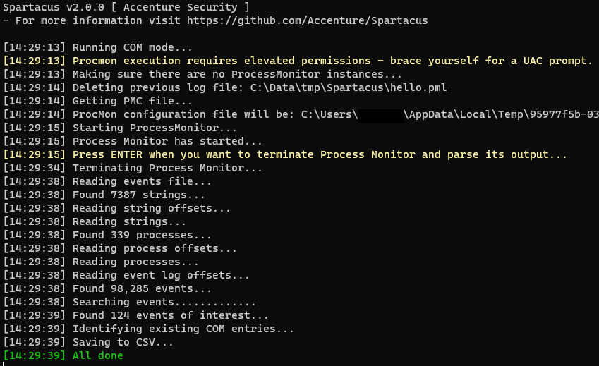
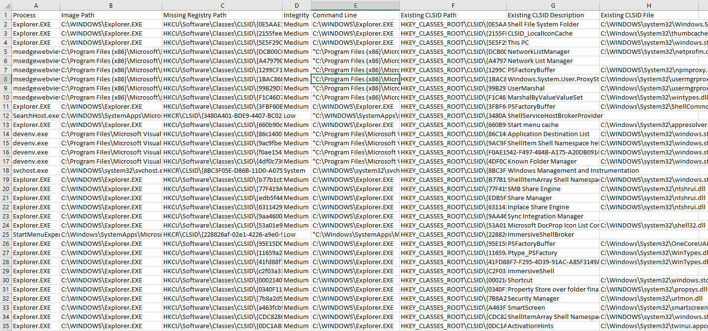

# Spartacus DLL/COM Hijacking Toolkit 

## Why "Spartacus"?

If you have seen the film Spartacus from 1960, you will remember the scene where the Romans are asking for Spartacus to give himself up. The moment the real Spartacus stood up, a lot of others stood up as well and claimed to be him using the "I AM SPARTACUS" phrase.

When a process that is vulnerable to DLL Hijacking is asking for a DLL to be loaded, it's kind of asking "WHO IS VERSION.DLL?" and random directories start claiming "I AM VERSION.DLL" and "NO, I AM VERSION.DLL". And thus, Spartacus.

## How is this tool different to all the other hijacking tools out there?

* Spartacus automates most of the process. It parses raw [SysInternals Process Monitor](https://learn.microsoft.com/en-us/sysinternals/downloads/procmon) logs, and you can leave ProcMon running for hours and discover 2nd and 3rd level DLL/COM hijacking vulnerabilities (ie an app that loads another DLL that loads yet another DLL when you use a specific feature of the parent app).
* Automatically generate Visual Studio solutions for vulnerable DLLs.
* Able to process large PML files and store all events of interest output into a CSV file. Local benchmark processed a 3GB file with 8 million events in 45 seconds.
* Supports scanning for both DLL and COM hijacking vulnerabilities.
* Supports generating self-signed certificates and signing DLL files.
* By utilising [Ghidra](https://github.com/NationalSecurityAgency/ghidra) functionality, extract export function signatures and execute your payload via individually proxied functions instead of running everything from `DllMain`. This technique was inspired and implemented from the walkthrough described at https://www.redteam.cafe/red-team/dll-sideloading/dll-sideloading-not-by-dllmain, by [Shantanu Khandelwal](https://twitter.com/shantanukhande).
* `[Defence]` Monitoring mode trying to identify running applications proxying calls, as in "DLL Hijacking in progress". This is just to get any low hanging fruit and should not be relied upon.

# Table of Contents

* [Installation](#installation)
* [Supported Functionality](#supported-functionality)
    * [DLL Hijacking](#dll-hijacking)
        * [Usage](#dll-hijacking-usage)
    * [COM Hijacking](#com-hijacking)
        * [Usage](#com-hijacking-usage)
    * [DLL Proxy Generation](#dll-proxy-generation)
        * [Usage](#dll-proxy-generation-usage)
    * [Signing DLL Files](#signing-dll-files)
        * [Usage](#usage-for-signing-dll-files)
    * [DLL Hijacking Detection](#dll-hijacking-detection)
* [Command Line Arguments](#command-line-arguments)
* [Contributions](#contributions)
* [Credits](#credits)

# Installation

Find and download the latest version of Spartacus under [Releases](https://github.com/Accenture/Spartacus/releases). Otherwise simply clone this repository and build from source.

# Supported Functionality

Below is a description of each of the modes that Spartacus supports. 

**Note**: Command line arguments have significantly changed from v1 to v2.

## DLL Hijacking

The original functionality of Spartacus was solely finding DLL hijacking vulnerabilities. The way it works is:

1. Generate a ProcMon (PMC) config file on the fly, based on the arguments passed. The filters that will be set are:
    * Operation is `CreateFile`.
    * Path ends with `.dll`.
    * Process name is not `procmon.exe` or `procmon64.exe`.
    * Enable `Drop Filtered Events` to ensure minimum PML output size.
    * Disable `Auto Scroll`.
2. Execute Process Monitor and halt until the user presses `ENTER`.
3. User runs/terminates processes, or leave it running for as long as they require.
4. Terminates Process Monitor upon the user pressing `ENTER`.
5. Parses the output Event Log (PML) file.
    1. Creates a CSV file with all the NAME_NOT_FOUND and PATH_NOT_FOUND DLLs.
    2. Compares the DLLs from above and tries to identify the DLLs that were actually loaded.
    3. For every "found" DLL it generates a Visual Studio solution for proxying all of the identified DLL's export functions.

### DLL Hijacking Usage

Collect all events and save them into `C:\Data\logs.pml`. All vulnerable DLLs will be saved as `C:\Data\VulnerableDLLFiles.csv` and all proxy DLLs solutions in `C:\Data\Solutions`.

```
--mode dll --procmon C:\SysInternals\Procmon.exe --pml C:\Data\logs.pml --csv C:\Data\VulnerableDLLFiles.csv --solution C:\Data\Solutions --verbose
```

Parse an existing PML event log output, save output to CSV, and generate proxy Visual Studio solutions.

```
--mode dll --existing --pml C:\MyData\SomeBackup.pml --csv C:\Data\VulnerableDLLFiles.csv --solution C:\Data\Solutions --verbose
```

### Screenshots




## COM Hijacking

A new functionality of Spartacus is to identify local COM hijacking vulnerabilities. The way it works is:

1. Generate a ProcMon (PMC) config file on the fly, based on the arguments passed. The filters that will be set are:
    * Operation is `RegOpenKey`.
    * Process name is not `procmon.exe` or `procmon64.exe`.
    * Enable `Drop Filtered Events` to ensure minimum PML output size.
    * Disable `Auto Scroll`.
2. Execute Process Monitor and halt until the user presses `ENTER`.
3. User runs/terminates processes, or leave it running for as long as they require.
4. Terminates Process Monitor upon the user pressing `ENTER`.
5. Parses the output Event Log (PML) file.
    1. Identifies all missing registry keys that end in `InprocServer32` and its result is `NAME_NOT_FOUND`.
    2. If the identified key is under `HKEY_CURRENT_USER`, search for its GUID under `HKEY_CLASSES_ROOT` and include its details in the export CSV (if found).
    3. Create a CSV output with all the gathered information.
6. Spartacus doesn't automatically create a Visual Studio solution for COM hijacking, however if you need to create a proxy DLL you can use the `proxy` mode.

For COM hijacking Spartacus also supports scanning the local system for misconfigured COM entries:

1. Enumerate all of `HKEY_CLASSES_ROOT`, `HKEY_CURRENT_USER`, and `HKEY_LOCAL_MACHINE`.
2. Look for registry keys that are called `InProcServer`, `InProcServer32`, `LocalServer`, or `LocalServer32`.
3. Identify any missing EXE/DLL locations, along with any ACL misconfiguration such as the ability to Modify or Delete the file by the current user.

### COM Hijacking Usage

Collect all events and save them into `C:\Data\logs.pml`. All vulnerable COM information will be saved as `C:\Data\VulnerableCOM.csv`.

```
--mode com --procmon C:\SysInternals\Procmon.exe --pml C:\Data\logs.pml --csv C:\Data\VulnerableCOM.csv --verbose
```

Process an existing PML file to identify vulnerable COM entries.

```
--mode com --existing --pml C:\Data\logs.pml --csv C:\Data\VulnerableCOM.csv --verbose
```

Enumerate the local system registry to identify missing/misconfigured COM libraries and executables.

```
--mode com --acl --csv C:\Data\VulnerableCOM.csv --verbose
```

### Screenshots





## DLL Proxy Generation

Spartacus supports generating Visual Studio solutions by creating skeleton projects for you to use, based on the DLL you wish to exploit.

* Redirecting all calls by exporting functions back to the legitimate DLL.
    * This means that you will have to execute your payload from the `DllMain` function.
* Using Ghidra, extract as many function signatures/definitions as possible from the target DLL, and create proxy functions for these.
    * For any function that extracting its signature was not possible, it will be directly redirected to the legitimate function/dll.
    * This means you can execute your payload from a function outside of `DllMain`.
    * For instance, if you wish to exploit `version.dll` you could run your implant from `GetFileVersionInfoExW` if that function is called by the vulnerable application.

### DLL Proxy Generation Usage

Generate a solution that redirects all exports (no function proxying).

```
--mode proxy --dll C:\Windows\System32\version.dll --solution "C:\data\tmp\refactor-version" --overwrite --verbose --external-resources
```

It is possible to input multiple DLLs at once.

```
--mode proxy --dll C:\Windows\System32\version.dll --dll C:\Windows\System32\userenv.dll --solution "C:\data\tmp\dll-collection" --overwrite --verbose --external-resources
```

Create proxies for as many functions as possible (based on Ghidra's output).

```
--mode proxy --ghidra C:\ghidra\support\analyzeHeadless.bat --dll C:\Windows\System32\userenv.dll --solution C:\Projects\spartacus-userenv --overwrite --verbose
```

Same as above, but use external asset files to generate the solution (if you need to modify them).

```
--mode proxy --ghidra C:\ghidra\support\analyzeHeadless.bat --dll C:\Windows\System32\userenv.dll --solution C:\Projects\spartacus-userenv --overwrite --verbose --external-resources
```

Utilise pre-generated function prototypes for functions which Ghidra was unable to extract function definitions for.

```
--mode proxy --ghidra C:\ghidra\support\analyzeHeadless.bat --dll C:\Windows\System32\userenv.dll --solution C:\Projects\spartacus-userenv --overwrite --verbose --external-resources --prototypes C:\data\prototypes.csv
```

Generate proxies only for functions `GetFileVersionInfoExW` and `GetFileVersionInfoExA`.

```
--mode proxy --ghidra C:\ghidra\support\analyzeHeadless.bat --dll C:\Windows\System32\version.dll --solution C:\Projects\spartacus-version --verbose --overwrite --external-resources --only "GetFileVersionInfoExW, GetFileVersionInfoExA"
```

Generate a function prototype database from existing *.h files, assisting in generating proxy functions for ones that Ghidra was not able to extract its function definition.

```
--mode proxy --action prototypes --path "C:\Program Files (x86)\Windows Kits" --csv C:\data\prototypes.csv --verbose
```

List DLL's exports and check if each function has a pre-generated prototype.

```
--mode proxy --action exports --dll C:\Windows\System32\version.dll --dll C:\Windows\System32\amsi.dll --prototypes ./Assets/prototypes.csv
```

## Signing DLL Files

Spartacus now supports generating self-signed certificates (while copying attributes from existing files), and signing DLL files.

### Usage for Signing DLL Files

Create a signing certificate, using properties from `C:\Windows\System32\version.dll` (has to be signed DLL).

```
--mode sign --action generate --pfx "C:\Output\certificate.pfx" --password "Welcome1" --not-before "2022-12-31 00:00:55" --not-after "2026-01-01 00:00:01" --copy-from C:\Windows\System32\version.dll --verbose
```

Sign a DLL using an existing/generated certificate.

```
--mode sign --action sign --pfx "C:\Output\certificate.pfx" --password "Welcome1" --path "C:\Input\MyFakeVersion.dll" --algorithm SHA256 --verbose
```

## DLL Hijacking Detection

Spartacus also has a `--detect` mode, which tries to identify active DLL proxying. The logic behind it is:

* Enumerate all processes.
* For each process, load the DLLs (modules) it has loaded into memory (assuming you have the right permissions to do so).
* If you find a DLL with the same name:
    * If both files as in an OS path (ie Windows, System32, Program Files), ignore.
    * If only one of the files is in an OS path and the other is in a user-writable location, flag the file.

To use this feature, simply run Spartacus with `--detect`.

## Self-Signing Executables/DLLs

Spartacus supports the `--sign` mode which allows you to both generate self-signed certificates, but also sign compiled DLLs with them.

Generate a self-signed certificate, copying the Issuer/Subject from an existing file:

```
--mode sign --action generate --pfx "C:\Output\myCertificate.pfx" --password "Welcome1" --not-before "2023-01-01 00:00:04" --not-after "2025-01-01 00:00:42" --copy-from C:\Windows\System32\version.dll --verbose
```

And use that certificate to sign your compiled file:

```
--mode sign --action sign --pfx "C:\Output\myCertificate.pfx" --password "Welcome1" --path "C:\Projects\Spartacus-AMSI\amsi.dll" --algorithm SHA256 --verbose
```

# Command Line Arguments

To make your life easier, use the [CommandLineGenerator.html](CommandLineGenerator.html) file.

| Mode              | Argument                  | Description |
| ----------------- | ------------------------- | ----------- |
|                   | `--mode`                  | Define the mode to use, one of: `dll`, `proxy`, `com`, and `detect`. |
| `all`             | `--verbose`               | Enable verbose output. |
| `all`             | `--debug`                 | Enable debug output. |
| `all`             | `--external-resources`    | By default Spartacus will use embedded resources for generating VS solution files etc. If you need to modify the templates, use this argument to make Spartacus load all files from the `./Assets` folder. |
| `dll`, `com`      | `--procmon`               | Location (file) of the SysInternals Process Monitor `procmon.exe` or `procmon64.exe` |
| `dll`, `com`      | `--pml`                   | Location (file) to store the ProcMon event log file. If the file exists, t will be overwritten. When used with --existing it will indicate the event log file to read from and will not be overwritten. |
| `dll`, `com`      | `--pmc`                   | Define a custom ProcMon (PMC) file to use. This file will not be modified and will be used as is. |
| `dll`, `com`      | `--csv`                   | Location (file) to store the CSV output of the execution. |
| `dll`, `proxy`    | `--solution`              | Path to the directory where the solutions for the proxy DLLs will be stored. |
| `dll`, `com`      | `--existing`              | Switch to indicate that Spartacus should process an existing ProcMon event log file (PML). To indicate the event log file use --pml, useful when you have been running ProcMon for hours or used it in Boot Logging. |
| `dll`             | `--all`                   | By default any DLLs in the Windows or Program Files directories will be skipped. Use this to include those directories in the output. |
| `proxy`           | `--ghidra`                | Path to Ghidra's 'analyzeHeadless.bat' file. Used when you want to proxy specific functions rather than just `DllMain`. |
| `proxy`           | `--dll`                   | Path to the DLL you want to proxy, and can include multiple instances of this argument. In addition, can also contain wildcards like `C:\Windows\System32\*.dll` - however all paths have to end in `*.dll`. |
| `proxy`, `sign`   | `--overwrite`             | If the `--solution` (proxy) or `--pfx` (sign) file already exists, use this flag to overwrite it. |
| `proxy`           | `--only`                  | Generate proxy functions only for functions defined in this variable. Values are comma separated like `'WTSFreeMemory,WTSFreeMemoryExA,WTSSetUserConfigA'`. |
| `proxy`           | `--action`                | Default action is to generate a VS solution. `--action prototypes`, takes as input a Windows SDK folder and parses *.h files in order to generate a database of function prototypes. `--action exports` displays a DLL's export functions and when complimented with `--prototypes` it will display if the function definition has been pre-generated. |
| `sign`            | `--action`                | When using `--action` with the `sign` module, it takes one of two options, `generate` for creating a PFX and `sign` for signing a file. |
| `proxy`           | `--path`                  | Currently only works with `--action prototypes` and is the location of a Windows SDK directory. |
| `proxy`           | `--prototypes`            | Location of prototypes.csv (currently within the `./Assets` folder). |
| `com`             | `--acl`                   | Enumerate local system for missing/misconfigured COM libraries and executables. |
| `sign`            | `--subject`               | Used with `--action generate` to specify the certificate subject. |
| `sign`            | `--issuer`                | Used with `--action generate` to specify the certificate's issuer. |
| `sign`            | `--copy-from`             | Used with `--action generate` to specify an existing signed file to copy the Issuer and Subject from. |
| `sign`            | `--not-before`            | Used with `--action generate` to define the date from when the new certificate will be valid from, format is YYYY-MM-DD HH:MM:SS. |
| `sign`            | `--not-after`             | Used with `--action generate` to define the date from when the new certificate will be valid until, format is YYYY-MM-DD HH:MM:SS. |
| `sign`            | `--pfx`                   | When used with `--action generate` this is where the pfx file will be saved as. When used with `--action sign` this is where the pfx file will be loaded from. |
| `sign`            | `--password`              | When used with `--action generate` it defines the password for the `--pfx` file. |
| `sign`            | `--path`                  | When used with `--action sign` it defines the location of the executable/DLL file to be signed. |
| `sign`            | `--algorithm`             | When used with `--action sign` it defines the hashing algorithm that will be used for signing. Options are: MD5, SHA1, SHA256, SHA384, SHA512. |
| `sign`            | `--timestamp`             | When used with `--action sign` it defines the Timestamp Server, like http://timestamp.sectigo.com or http://timestamp.digicert.com. |

# Contributions
Whether it's a typo, a bug, or a new feature, Spartacus is very open to contributions as long as we agree on the following:
* You are OK with the MIT license of this project.
* Before creating a pull request, create an issue so it could be discussed before doing any work as internal development is not tracked via the public GitHub repository. Otherwise you risk having a pull request rejected if for example we are already working on the same/similar feature, or for any other reason.

# Credits

* https://github.com/eronnen/procmon-parser/
* https://www.redteam.cafe/red-team/dll-sideloading/dll-sideloading-not-by-dllmain
* https://stmxcsr.com/persistence/com-hijacking.html
* Icon for Spartacus is from [Helmet icons created by Darius Dan - Flaticon](https://www.flaticon.com/free-icons/helmet) | https://dariusdan.com/
* https://github.com/Danielku15/SigningServer
